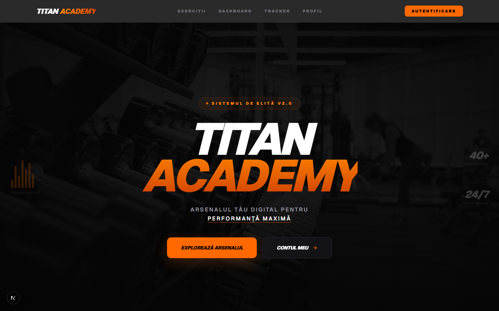

# 🏋️ Titan Academy

**Aplicație web completă de fitness** — tracker de antrenamente, jurnal de nutriție și analiză de progres, construită cu Next.js și Supabase.



## ✨ Funcționalități

### 🔐 Autentificare
- Cont cu **email și parolă** (înregistrare, login, resetare parolă prin email)
- **Login cu Google** (OAuth prin Supabase, cu selector de cont)
- Rute protejate prin middleware — paginile personale cer autentificare

### 📊 Dashboard
- Rezumatul zilei: antrenamentele de azi, volumul total, caloriile consumate față de țintă
- Statistici pe luna curentă și acces rapid către toate secțiunile

### 💪 Tracker de antrenamente
- Logare **per set** (repetări + greutate pe fiecare set), cu comasarea automată a seturilor identice
- **Sesiune activă din plan**: alegi planul zilei, aplicația te ghidează exercițiu cu exercițiu, cu bife, auto-avans și rezumat la final
- **Detectare de recorduri personale (PR)** la salvare
- Precompletare inteligentă: la selectarea unui exercițiu vezi ce ai lucrat „ultima dată"
- Istoric complet cu editare inline

### 📈 Progres per exercițiu
- **1RM estimat** (formula Epley) calculat din fiecare sesiune
- Grafic SVG custom cu 3 metrici: greutate maximă, e1RM și volum
- Istoricul tuturor sesiunilor pentru exercițiul ales

### 🥗 Nutriție
- Calcul **TDEE** (formula Mifflin-St Jeor) și ținte de macronutrienți personalizate după obiectiv (slăbit / menținut / masă)
- Jurnal zilnic: calorii, proteine, carbohidrați, grăsimi, apă
- Inel de progres al caloriilor și grafic săptămânal
- Ținte editabile manual

### 📚 Catalog de exerciții
- Peste 50 de exerciții cu **fotografii demonstrative**, instrucțiuni pas cu pas, sfaturi de execuție și video
- Filtrare pe grupe musculare, căutare, logare direct din pagina exercițiului

### 👤 Profil
- Date personale (greutate, înălțime, vârstă, obiectiv), **IMC calculat automat**, avatar încărcat în Supabase Storage

### 📱 PWA
- Instalabilă pe telefon (manifest + service worker + iconițe) — se comportă ca o aplicație nativă

## 🛠️ Stack tehnologic

| Layer | Tehnologie |
|---|---|
| Framework | Next.js 16 (App Router, Turbopack) |
| UI | React 19, Tailwind CSS 4 |
| Limbaj | TypeScript |
| Backend | Supabase (PostgreSQL, Auth, Storage) |
| Auth | Supabase Auth — email/parolă + Google OAuth (flux PKCE cu callback server-side) |

## 🗄️ Structura bazei de date

| Tabelă | Conținut |
|---|---|
| `profiles` | Datele utilizatorului: nume, greutate, înălțime, vârstă, gen, obiectiv |
| `exercises` | Catalogul de exerciții: nume, slug, grupă musculară, echipament, instrucțiuni, sfaturi |
| `workouts` | Logurile de antrenament: exercițiu, seturi, repetări, greutate, notițe, dată |
| `nutrition` | Jurnalul zilnic: calorii, macronutrienți, apă, notițe |

Plus un bucket de Storage (`avatars`) pentru pozele de profil. Toate tabelele folosesc **Row Level Security** — fiecare utilizator își vede doar propriile date.

## 🚀 Rulare locală

**1. Clonează și instalează:**

```bash
git clone https://github.com/raducugabriel02/titan-academy.git
cd titan-academy
npm install
```

**2. Configurează Supabase** — creează un proiect pe [supabase.com](https://supabase.com) și adaugă cheile în `.env.local`:

```
NEXT_PUBLIC_SUPABASE_URL=https://<proiectul-tau>.supabase.co
NEXT_PUBLIC_SUPABASE_ANON_KEY=<cheia-anon>
```

**3. Populează catalogul de exerciții:**

```bash
npx ts-node scripts/seed.ts
```

**4. Pornește serverul de dezvoltare:**

```bash
npm run dev
```

Aplicația rulează pe [http://localhost:3000](http://localhost:3000).

> Pentru login-ul cu Google e nevoie și de un OAuth Client ID în Google Cloud Console, conectat la Supabase (Authentication → Providers → Google).

## 🧩 Detalii de implementare

- **Grafice desenate manual în SVG** — fără librării de charting; inelul de calorii și graficul de progres sunt componente proprii.
- **Callback OAuth server-side** (`app/auth/callback/route.ts`) — schimbă codul PKCE pe sesiune pe server, apoi redirecționează; cookie-urile de sesiune sunt gestionate cu `@supabase/ssr`.
- **Zile calendaristice locale** (`lib/dates.ts`) — toate calculele pe zile folosesc fusul orar al utilizatorului, nu UTC, ca jurnalul să nu „sară" ziua la miezul nopții.
- **Sesiunea de antrenament** persistă în `localStorage` — dacă închizi pagina în mijlocul antrenamentului, la revenire continui de unde ai rămas.
- **Seturile consecutive identice se comasează** la salvare (3 seturi de 10×60kg devin un singur rând `3×10×60`), ca istoricul să rămână curat.
